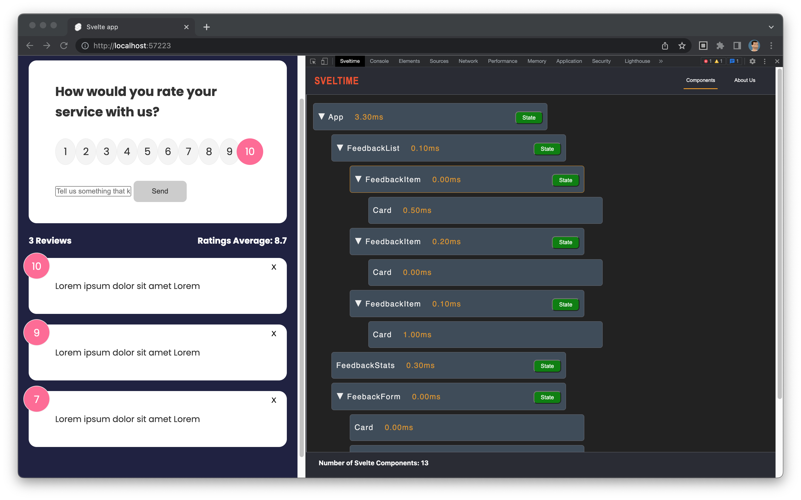
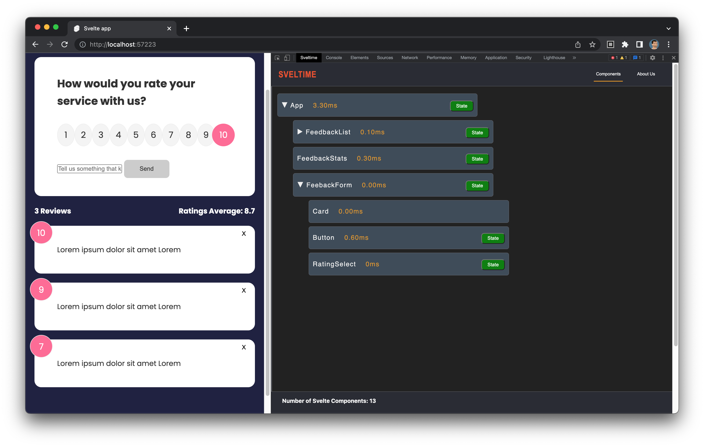
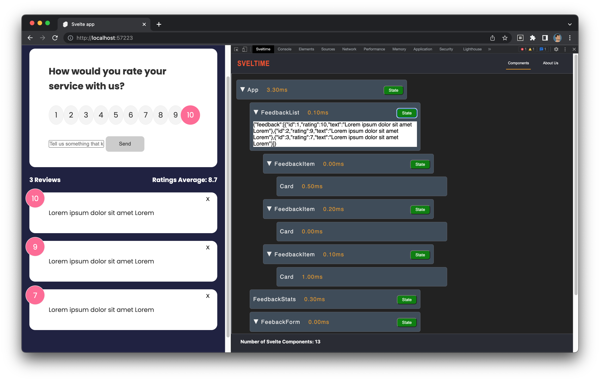

Download from the Chrome Extension Store

**About Sveltime**

Other frameworks have long had a variety of tools available for development and debugging. Svelte developers have not. Using our Chrome Dev Tool extension, Svelte developers can see their components hierarchically, with render times and state available at the component level.

**Features**

* Displays all rendered Svelte components

    

* Puts components in a hierarchical collapsible tree format.

* The state for any component can be displayed at the click of a button

* Render times are displayed for each component. (**_beta_**)

**Directions**

1. Download Sveltime from Chrome Extension Store and install.
2. Alternatively, you can clone the Sveltime repository on GitHub, install dependencies, and load it “unpacked” into the Chrome extension manager.
3. Run your own Svelte app in dev mode.
4. Open your app in Chrome.
5. Open Chrome Dev Tools and click on the Sveltime tab
6. Immediately you will see your app in component-tree format
7. You can click on any component to hide or reveal its children components
8. Render time can be seen to the right of each component’s name
9. Clicking on the green ‘state’ button will open a drawer which contains the state information for that component. 

**Authors**

 
### Sunit Bhalotia  
<a href="https://github.com/usr193">Sunit's GitHub</a> 
<a href="https://www.linkedin.com/in/sunitb/">Sunit's LinkedIn</a>

 

 
### William Reiff  
<a href="https://github.com/wrreiff">William's GitHub</a> 
<a>William's LinkedIn</a>

 
### Mustafa Saleem  
<a href="https://github.com/Mas-150">Mustafa's GitHub</a> 
<a href="https://www.linkedin.com/in/mas150/">Mustafa's LinkedIn</a>

 
## Peter Steinberg  
<a href="https://github.com/bklynpeter">Peter's GitHub</a> 
<a href="https://www.linkedin.com/in/bklynpeter/">Peter's LinkedIn</a>

**Areas for Future Development**

* Time Jump/Snapshot on changes in state
* Visualization flow chart
* Display stores alongside components
* Have extension work with server-side rendering

**How to Contribute**

Link to Contribute document

**License**

M.I.T.

**Sveltime is available now on the Chrome Store and on GitHub**
